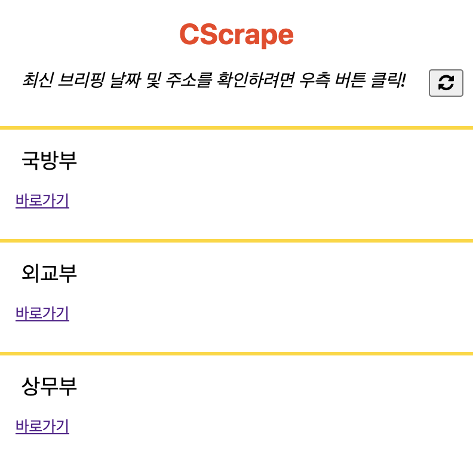
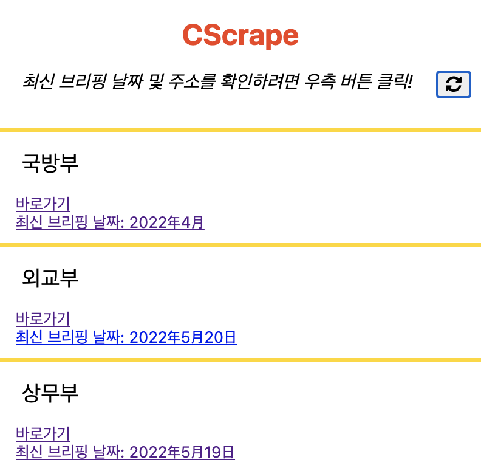

# CScrape

A Chrome extension that provides date and url of the most recent article published on specific websites

## Getting Started

### Installing

* Go to Chrome Web Store and search "CScrape"
* Click "Add to Chrome"

### How to use CScrape

* Click the refresh button

* Check out recent articles

## Authors

donburi82

## Updates

* 16th May 2022
    * Initial Release
* 21st May 2022
    * Updated logo images
    * Removed unnecessary permissions in manifest.json
    * Removed messages for testing in script.js

## Acknowledgments

* [README-template](https://gist.github.com/DomPizzie/7a5ff55ffa9081f2de27c315f5018afc)
